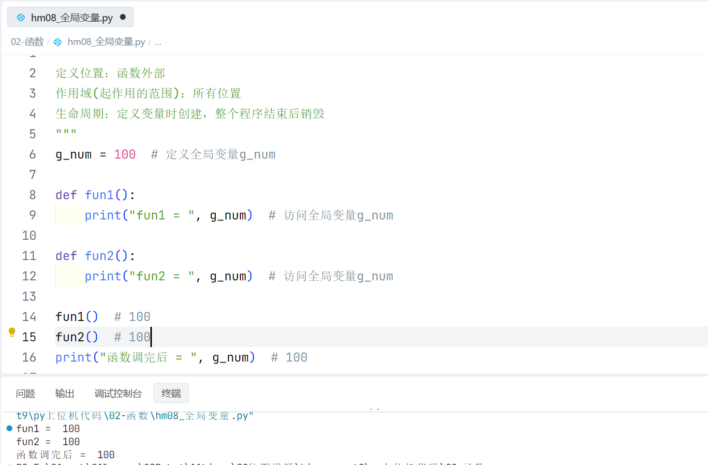
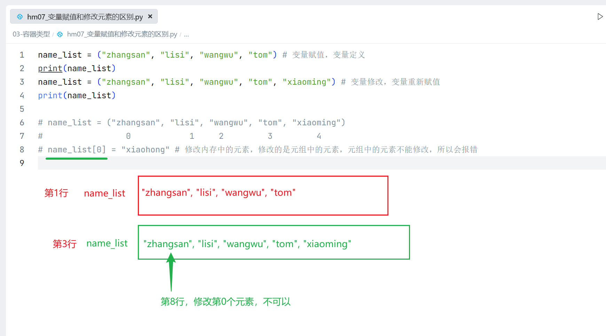
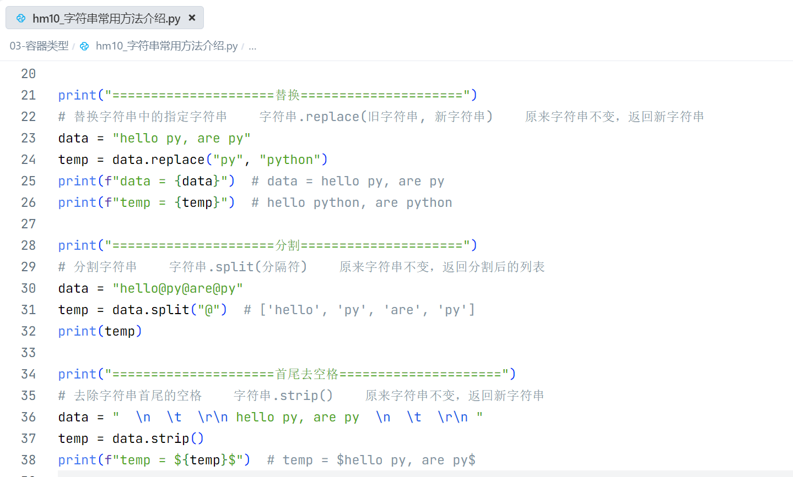

# 函数、容器

[toc]


## 一、函数

- 所谓函数， 就是把具有独立功能的代码块组织为一个小模块， 在需要的时候调用
- 步骤:
    - 定义函数 -> 封装代码
    - 调用函数 -> 使用代码
- 作用: 对具备相同逻辑的代码进行封装，调高代码的编写效率，实现对代码的重用

### 1.1 函数基本使用

#### 1.1.1 无参无返回值


#### 1.1.2 有参无返回值


#### 1.1.3 有参有返回值


#### 1.1.4 函数返回多个值


### 1.2 局部变量和全局变量

#### 1.2.1 局部变量


#### 1.2.2 全局变量




## 二、容器类型

1. 重点学习容器的定义

2. 常用操作的建议

    - 跟着课堂把代码写一遍即可，混个脸熟，后面<font color='red'>现用现查</font>

    - 增、删、改、查：重点掌握 <font color='red'>查</font>
        - <font color='red'>字符串、元组：只能查，不能改</font>
            - 不可变类型

### 2.1 列表list

#### 2.1.1 列表基本语法


#### 2.1.2 列表常用方法介绍


#### 2.1.3 列表嵌套


#### 2.1.4 列表案例：办公室分配


### 2.2 元组tuple

#### 2.2.1 元组基本语法




#### 2.2.2 元组组包和拆包


### 2.3 字符串str

#### 2.3.1 字符串基本语法


#### 2.3.2 字符串常用方法介绍




#### 2.3.3 字符串案例：用户名和密码校验


### 2.4 集合set

#### 2.4.1 集合基本使用


### 2.5 字典dict

#### 2.5.1 字典基本语法


#### 2.5.2 字典常用方法介绍


#### 2.5.3 字典遍历


### 2.6 切片slice

```python
"""
说明: 通过切片操作, 可以获取数据中指定部分的内容
    - 适用类型: 字符串(str)/列表(list)/元组(tuple)
语法: 数据[起始索引:结束索引:步长]
0. 步长默认为1，步长理解为走几步，正数从左往右取数，负数从右往左取数
1. 字符串[开始索引:结束索引] 开始索引 ~（结束索引的上一个）
2. 字符串[开始索引: ] 开始索引 ~ 末尾最后一个元素，末尾索引不写，默认能取到末尾那个索引
3. 字符串[ :结束索引] 0 ~（结束索引的上一个），开始索引不写，如果步长为1，默认从第0个元素开始

str_data = 'abcdefg'
#           0123456
# 1. 取出 cde
# 2. 取出 abcde
# 3. 取出 bcdefg
# 4. 取出 aceg
# 5. 取出 fg
# 6. 字符串翻转，逆向输出 gfedcba
"""
```

### 2.7 推导式

#### 2.7.1 推导式基本语法

#### 2.7.2 推导式练习

```python
需求：
1. 请写出一段 Python 代码实现分组一个 list 里面的元素
2. 需要将列表中三个元素一组分隔，剩下的最后一组，其实就是对列表进行切片操作
3. 比如 [1,2,3,...100] 变成 [[1,2,3],[4,5,6]....[100]]
```


### 2.8 容器公共方法

### 2.9 案例：字符串逆序统计

 
