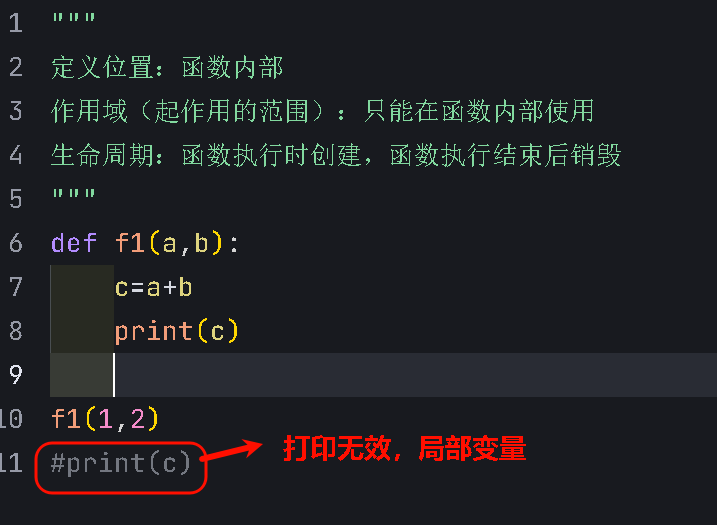
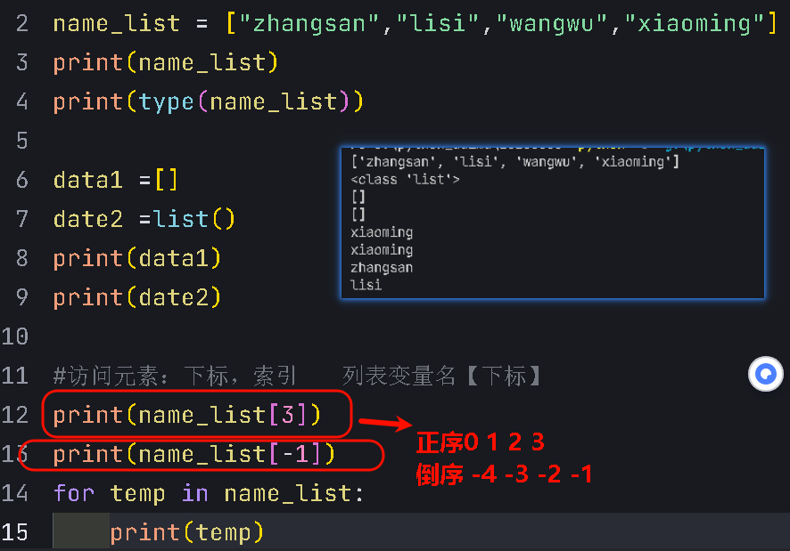
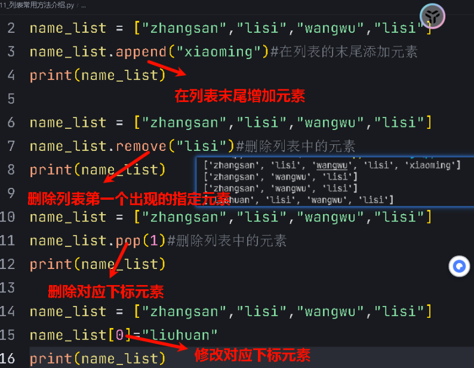

# **函数，容器语法**

### 函数基本使用

#### 1.无参无返回值

#### 2.有参无返回值

#### 3.有参有返回值

#### 3.函数返回多个值

#### 4.return使用

### 局部变量和全局变量

#### 2.1局部变量

#### 2.2全局变量

# 容器类型

列表，元组，集合，str，字典

### 1.列表list

#### 1.1列表基本语法

#### 1.2列表常用方法

#### 1.3列表嵌套

#### 1.4列表案例：办公室分配

### 2.元组tuple

#### 2.1元组基本语法

#### 2.2元组的组包和拆包

### 3.字符串str

#### 3.1字符串基本语法

#### 3.2字符串常用方法介绍

#### 3.3字符串案例：用户名和密码校验

### 4.集合set

#### 4.1集合基本使用

### 5.字典dict

#### 5.1字典基本语法

#### 5.2字典常用方法介绍

#### 5.3字典遍历

