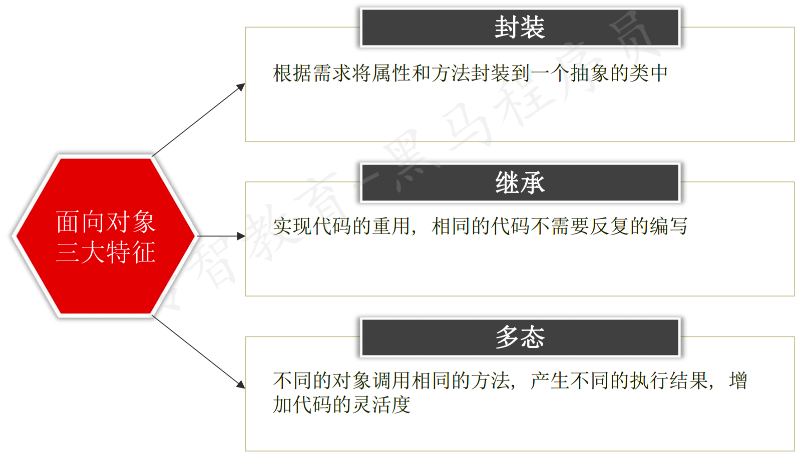

# 面向对象

[toc]

## 一、基础语法

### 1.1  简介

- 面向对象编程: Object Oriented Programming 简写 OOP

- 在面向对象的世界里：万事万物皆对象

- 面向过程

    - 买菜、洗菜、切菜、做菜，按步骤完成这个过程

- 面向对象

    - 弄了一个自动炒菜机对象，把买菜、洗菜、切菜、做菜封装在机器里
    - 面向对象对面向过程做了进一步的封装

- 类和对象是面向对象非常重要的概念

    - 类是描述了一种类型(相当于图纸)
    - 对象是这个类型的具体实现(相当于图纸具体实现)

    
    
    
    
    - 类3要素
        - 类名
        - 属性(变量)
        - 方法(函数)

### 1.2 基础语法


#### 1.2.1 类和方法基本使用


#### 1.2.2 类外添加和使用属性


#### 1.2.3 self参数的使用


### 1.3 魔法方法(内置方法)

#### 1.3.1 无参`__init__`方法使用

- `__`为双下划线


#### 1.3.2 带参`__init__`方法的使用


#### 1.3.3 `__str__`方法的使用


### 1.4 案例：房子摆放家具


- 家具类


- 房子类


- 摆放家具


### 1.5 访问权限


## 二、三大特性



### 2.1 封装

```python
"""
需求：
• 进入某 Web 项目登录页面， 输入用户名、 密码、 验证码之后登录系统
要求：
• 用户名为'admin'，密码为'123abc'，验证码为：'abcd'，返回登陆成功，否则，返回登陆失败
"""
```


### 2.2 继承

在程序中，继承描述的是指的是**类与类**之间的关系，如下如所示：


- 站在**父类**的角度来看，**父类**派生出**子类**
- 站在**子类**的角度来看，**子类**继承于**父类**
- **父类**也叫**基类、超类**，**子类**也叫**派生类**
- <font color='red'>注意：使用继承时需要考虑类与类之间是否存在 is...a 的关系，不能盲目使用继承</font>
    - 猫类继承于动物类
    - 学生类继承于人类
    - 人类<font color='red'>不应该继承于</font>猫类
        - 人有猫的成员
            - has - a

#### 2.2.1 继承语法


#### 2.2.2 继承中的重写


### 2.3 多态

- 在python中，多态属于了解的内容

```python
"""
1. 多态指的是一类事物有多种形态
    多态，多种形态，调用同一个方法，不同的表现
2. 多态的概念依赖于继承
    有继承
    有重写
需求：
1. 中国人ZhHuman、美国人UsHuman、非洲人AfricaHuman都是属于Human人类的子类
2. 每个类都有eat方法，不同类不同表现
"""
```


## 三、练习

### 3.1  容器类设计

```python
"""
1) 容器类设计：
类名：Container
实例属性：data数据
实例方法：
    __init__: 添加实例属性
    get_len: 返回容器的元素个数，不能使用len函数
2) 验证功能如下：
str_obj = Container('mike')
print(f'元素个数：{str_obj.get_len()}')
list_obj = Container([1, 2, 3, 4, 5])
print(f'元素个数：{list_obj.get_len()}')
dict_obj = Container({'name': 'mike', 'age': 18})
print(f'元素个数：{dict_obj.get_len()}')
结果为：
元素个数：4
元素个数：5
元素个数：2
"""
```


### 3.2  小明爱跑步

```python
"""
需求：小明爱跑步
1. 小明 体重 75.0 公斤
2. 小明每次 跑步 会减肥 0.5 公斤
3. 小明每次 吃东西 体重增加 1 公斤
类名：Person
属性：姓名name, 体重weight
方法：
    __init__(): 增加属性
    __str__(): 以字符串格式返回属性信息
    run()：跑步方法
    eat(): 吃东西方法
    
4. 实例化对象，调用方法，验证结果
"""
```


### 3.3  烤地瓜

```python
"""
需求：设计 SweetPotato 地瓜类
1. 地瓜有两个属性：
    状态 state：初始状态为'生的'
    烧烤总时间 cooked_time：初始时间为0

2. 实现__str__方法，打印对象，输出：地瓜状态为：xxx, 烧烤总时间为：yyy 分钟
3. 定义 cook 方法, 形参为 time，传入本次烧烤时间
    1. 使用 烧烤总时间 对 本次烧烤时间 进行 累加，得到最新烧烤时间
    2. 根据 烧烤总时间, 设置地瓜的状态：
        0 <= 烧烤总时间 < 3 ： 生的
        3 <= 烧烤总时间 < 6 ： 半生不熟
        6 <= 烧烤总时间 < 8 ： 熟了
        大于等于8 ： 烤糊了
4. 创建对象，调用方法，验证结果
"""
```

