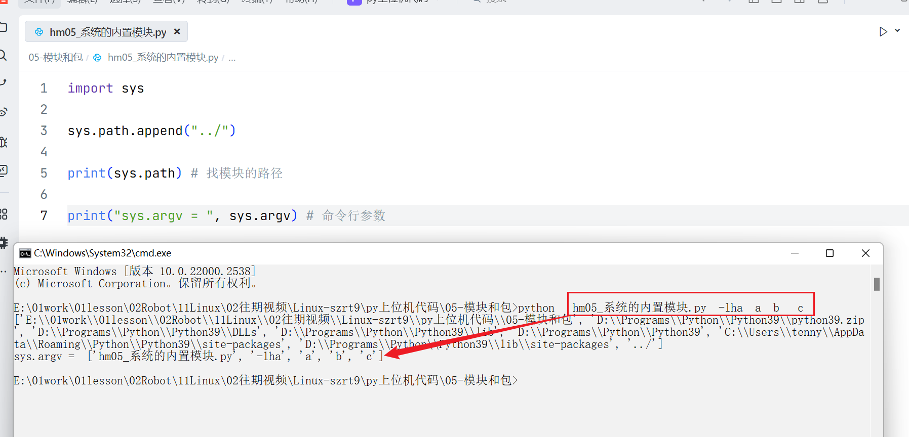
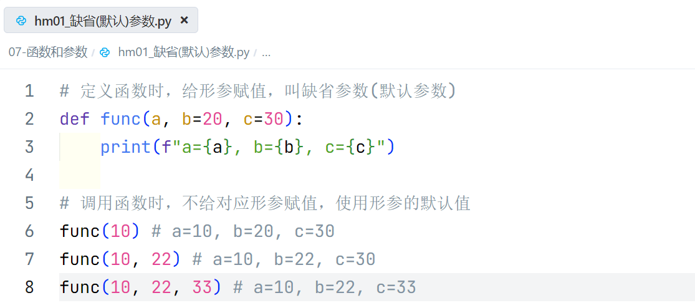
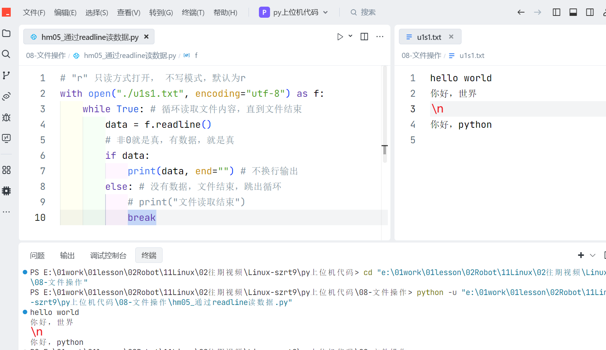

# 模块和包、异常、参数、文件

[toc]


## 一、模块和包

### 1.1 模块

- Python中模块就是一个`.py`文件，模块中可以定义`函数`，`变量`，`类`。
- 模块可以被其他模块引用

#### 1.1.1 导入模块


#### 1.1.2 导入冲突


#### 1.1.3 `__name__`作用说明

- 把导入模块不被执行的代码放在if `__name`__ == '`__main__`'里面
    - `__`为双下划线


### 1.2 包

- 包是一个特殊的文件夹，文件夹里包含一个`__init__.py`
    - 模块主要用于管理代码
    - 包主要用于管理模块
    - `__init__.py`主要写一下初始化的代码或导模块的语句，如果没有这部分需求，此文件可以没有
    - `__`为双下划线
    

#### 1.2.1 导入包中模块


### 1.3 系统的内置模块




## 二、异常处理

### 2.1 异常介绍

- 什么是异常?
    - 程序在运行过程中，发生了未知的事件，影响到了程序的正常运行
    - 异常是一种事件
    - 异常会影响到程序正常运行


### 2.2 捕获异常

- 为了保证程序正常运行

#### 2.2.1 捕获异常try-except

```python
"""
需求：
1. 提示用户输入一个整数，转换为int
    用户输入的可能不是一个整数
2. 使用 8 除以用户输入的整数并且输出
    0不能做除数
"""
```


#### 2.2.2 捕获异常完整语法

```python
"""
应用场景：
1. 成功打开文件的前提下，后面读写文件，不管有没有异常，最终都要关闭文件
2. 成功连接网络的前提下，后面发送或接收网络数据，不管有没有异常，最终都要断开连接

try:
    可能发生异常的代码
except:
    处理异常的代码
else:
    没有发生异常，except不满足执行else
finally:
    不管有没有异常，最终都要执行

需求：
1. 获取用户输入的数字，转换为int
2. 如果输入不是整数，转换会产生异常，提示输入错误
3. 如果是整数, 则进一步判断是奇数还是偶数
4. 最终提示: 程序运行结束
"""
```


### 2.3 自定义异常


#### 2.3.1 常见的异常类型介绍


#### 2.3.2 自定义异常


```python
# 抛出异常
# raise 异常类型名(提示信息)
class 自定义异常名(Exception):
    def __init__(self, msg):
        self.msg = msg

    def __str__(self):
        return self.msg
```


## 三、特殊参数

### 3.1 默认参数和关键字参数

#### 3.1.1 缺省(默认)参数




#### 3.1.2 关键字参数


### 3.2 可变参数

#### 3.2.1 元组型可变参数


#### 3.2.2 字典型可变参数


#### 3.2.3 可变参数拆包传参


#### 3.2.4 元组和字典可变参数组合使用


## 四、递归函数

- 函数递归调用：
    - 函数可以调用函数本身。

- 递归的优点
    - 递归给某些编程问题提供了最简单的方法。

- 递归的缺点
    - 一个有缺陷的递归会很快耗尽计算机的资源，递归的程序难以理解和维护。


## 五、文件IO

### 5.1 文件简介

- 文件： 可以存储在长期存储设备上的一段数据即为文件

- 文件操作流程

    ```yacas
    1. 打开文件
    2. 操作文件：写入/读取文件
    3. 关闭文件
    注意: 
    	1) 文件打开后, 一定要记着关闭, 防止占用过多的内存空间 
    	2) 文件操作都是系统后台实现的，用户看不到这个操作动作
    ```

    

### 5.2 打开和关闭文件

- 打开方式

    | **功能**   | **r** | **r+** | **w** | **w+** | **a** | **a+** |
    | ---------- | ----- | ------ | ----- | ------ | ----- | ------ |
    | 读         | +     | +      |       | +      |       | +      |
    | 写         |       | +      | +     | +      | +     | +      |
    | 创建       |       |        | +     | +      | +     | +      |
    | 覆盖       |       |        | +     | +      |       |        |
    | 指针在开始 | +     | +      | +     | +      |       |        |
    | 指针在结尾 |       |        |       |        | +     | +      |

- 路径

    - 绝对路径：电脑硬盘上真正保存的完整唯一路径
    - 相对路径：相对于当前的路径


### 5.3 文件写操作


### 5.4 文件读操作

#### 5.4.1 通过read读数据


#### 5.4.2 通过readline读数据



### 5.5 文件练习

#### 5.5.1 文件备份

```python
"""
1.输入文件名 文件名.txt
2.创建文件  文件名[备份].txt
3.读取文件, 写入到复制的文件中

abc.xyx.txt
01234567

abc.xyx  + 备份  +  .txt
src_name[:pos]  "备份"   src_name[pos:]
"""
```


#### 5.5.2 文件统计

```python
"""
需求：
1. 输入一个文件名，统计文件中代码行数、注释行数、空行数
2. 打印代码行数、注释行数、空行数
分析：
1.输入文件名 test.py
2.打开文件
3.统计 readline
    空行 空
    注释行数 去空格 #开头
    代码行数
"""
```


## 六、Py第三方插件安装

- 讲义链接：https://www.yuque.com/icheima/python/pip

- 配置pip国内镜像

    - pip安装的包都存在于外国的服务器上，速度会非常慢，可以给`pip`配置国内镜像，直接从国内服务器安装依赖。

    ```shell
    # 配置源
    pip config set global.index-url https://pypi.doubanio.com/simple
    # 重置源
    pip config unset global.index-url
    ```

- pyqt5环境搭建

    - https://www.yuque.com/icheima/python/pyqt_intro_env

    ```cmd
    pip install 插件名字	# 安装
    pip uninstall 插件名字	# 卸载
    pip install 插件名字 -i 指定下载的镜像网址
    pip show 插件名字		# 查看插件名字
    pip  list
    
    # 安装PyQt5
    pip  install  PyQt5  -i https://pypi.doubanio.com/simple
    # 安装Qt工具软件
    pip install PyQt5-tools -i https://pypi.doubanio.com/simple
    # 安装PyQt5语法检测包（可选）
    pip install PyQt5-stubs -i https://pypi.doubanio.com/simple
    
    # 查看安装版本
    pip  show  PyQt5
    pip  show  PyQt5-tools
    pip  show  PyQt5-stubs
    ```

    - pip代理问题安装不了解决方案：https://blog.csdn.net/zhangge3663/article/details/108869142

