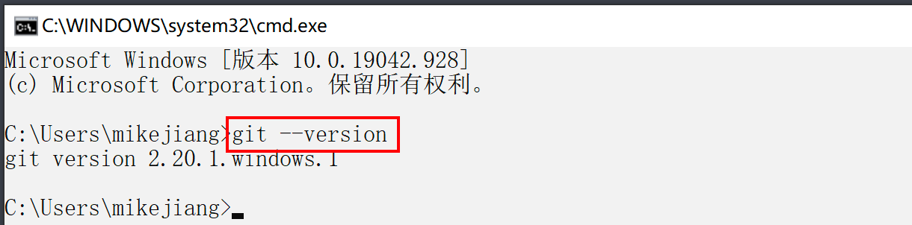
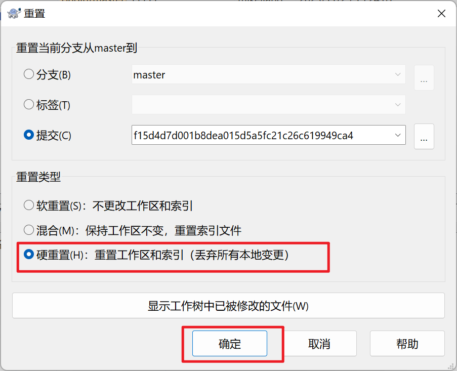
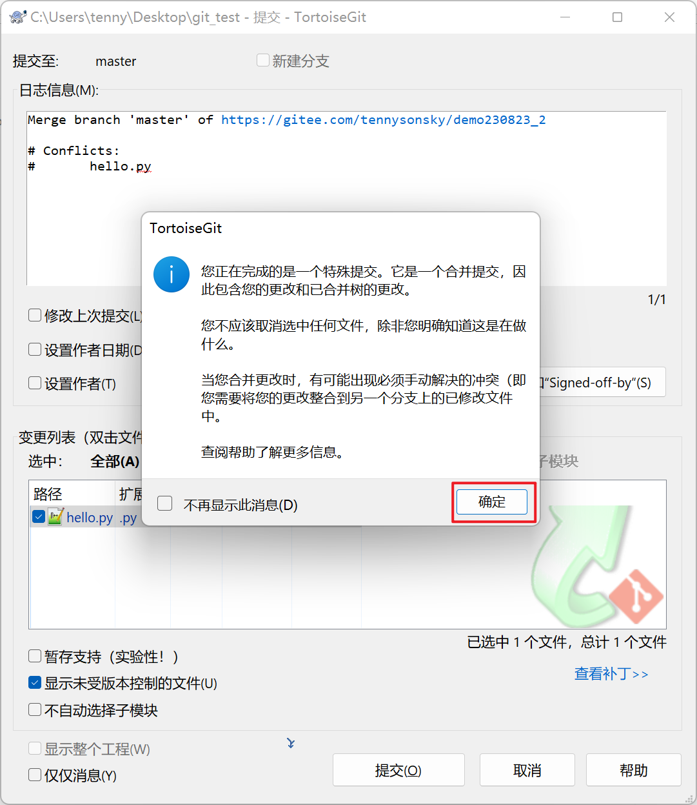

# Git、PyQt(上)

[toc]

## 一、版本控制git


### 1.1 git介绍和安装

- git是世界上最先进的分布式管理工具

    - 分布式：多个

- 主要用于：源代码管理

- 作用
    - 方便多人协同开发
    - 方便版本控制

- 安装

    1. 下载安装包， 下载地址： https://git-scm.com/downloads
        - 软件本地目录：[00课程配套资料\01软件\04版本控制](../../../00课程配套资料\01软件\04版本控制)
    2. 双击运行， 然后按**默认选项**，一路next, 安装即可

- 校验是否安装成功。 打开命令行窗口， 输入命令: git --version ， 看到git版本信息表示已安装成功

    - 这里只是举例，咱们安装的版本有可能和图片的不一致

    

- git操作流程

    


### 1.2 命令行操作

- 全局设置

    - 配置使用Git时的用户名和邮箱
    - 用户名和邮箱内容实际上可以乱写

    ```cmd
    git config --global user.email "email@example.com"
    git config --global user.name "Your Name"
    ```

    

#### 1.2.1 本地仓库操作

- 初始化仓库

    ```shell
    git init 		# 在指定目录初始化git本地仓库
    git status		# 查看仓库状态	
    ```

    

    - 合适位置新建一个git_test文件夹，在此目录下的终端操作

    .assets/image-20230823081403710.png)


- ### 提交代码

    ```shell
    git add 添加的文件			# 或 git add .
    git commit -m "日志信息"	# -m 后的提交日志必须要写
    git commit -am "日志信息"	 # add与commit合并操作
    ```

    .assets/image-20230823082130446.png)

.assets/image-20230823083202830.png)


#### 1.2.2 本地和远程仓库推拉

- **基于Git的代码仓库(代码管理平台)** 
    - **Gitee：** 在线的代码托管平台，国内网站
        
        - 网址：https://gitee.com/
            - 自己注册一个账号
            
            - **注意，注意：登陆账号可能不是用户名，登陆账号可能不是用户名**
            
            - 权限问题
            
                - .assets/image-20231221102934509.png)
                - 解决方案：https://blog.csdn.net/WwLK123/article/details/131731569
            
                - 生成秘钥
            
                    ```cmd
                    ssh-keygen -t rsa -C "你注册的或绑定的邮箱地址"
                    ```
            
                - 添加秘钥
            
                    .assets/image-20240517102436535.png)
    - GitHub： 在线的代码托管平台，国外网站
    
    - GitLab： 可以搭建在自己公司服务器上的代码管理软件
    
- 码云新建仓库

    - 新建仓库

        

    - 设置仓库信息

        .assets/image-20230823084320460.png)

- 推送代码到远程

    ```shell
    git remote add origin 远程仓库地址	# 添加远程仓库地址
    git push -u origin "master"			# 推送代码到远程
    ```

    .assets/image-20230823085411276.png)

- 凭据管理

    向git管理网站push代码时，首次需要输入账号和密码，后边会自动保存，如果需要查看、修改、删除。可打开Windows凭据管理。

    

    1. 点开始按钮（按下Windows键），搜索“凭据管理器”

    

    2. 点击Windows凭据，可对普通凭据里之前输入的用户名密码进行编辑和删除操作

    

- 拉取合并代码到本地

    ```shell
    git pull
    ```

    - 码云仓库远程修改代码

        .assets/image-20230823085121446.png)

        .assets/image-20230823085329602.png)

    - 本地拉取代码

        .assets/image-20230823085519041.png)

- 配置忽略文件

    - 在根目录的`.gitignore`文件中添加描述，对这些文件进行忽略

        ```shell
        # 忽略所有.swp结尾的文件
        *.swp
        
        # 忽略指定文件
        打包.zip
        
        # 忽略目录
        .idea/
        ```
        
    
    .assets/image-20230823092437254.png)
    
- 克隆仓库

    我们可以去开源平台上clone别人的代码，同样的，如果你的代码仓库是公开的，则别人可以下载到你的代码。

    .assets/image-20230823093048552.png)


### 1.3 界面操作

- 安装软件

    教程：https://www.yuque.com/icheima/python/dzrg8kggeg5hxrax#E01Qc

- 全局设置

    

- 初始化仓库

    - 如果没有此操作按钮，用命令初始化仓库即可
    
    .assets/image-20230823094718472.png)


- 提交代码

    .assets/image-20230823100543495.png)

- 推送代码

    .assets/image-20230823101526580.png)

- 拉取合并代码

    - 在远程仓库新建文件

        .assets/image-20230823101958854.png)

    - 拉取代码

        .assets/image-20230823102338037.png)

- 克隆代码

    .assets/image-20230823102713850.png)

- 重置版本

    

    .assets/image-20230823113411600.png)

    

- 重置版本(命令操作)

    .assets/image-20231221151857124.png)


### 1.4 解决代码冲突

- 产生原因
    - 多人对项目的代码同时进行维护的时候
    - 某一个同事对其中一个文件**hello.py**完成修改
    - 而你也对这个文件**hello.py**进行修改，并没有同步最新的代码，进行文件提交的时候，就会产生代码冲突

- 原则
    - 每天先pull(拉)最新的代码，再修改自己的代码
- 解决思路
    1. 找到差异点
    2. 根据差异，修改代码的实现逻辑(用你的代码，还是对方的，或者合并代码)
    3. 重新推送到远程代码仓库

.assets/image-20250509120227620.png)

1. 场景呈现

.assets/image-20230823105739339.png)

2. 冲突代码提交推送到远程仓库

- 最新仓库代码不一致，需要先拉最新的代码

    .assets/image-20230823110334188.png)

- 拉取最新代码提示如下

    

- 修改冲突代码

    

3. 重新提交，然后再推送到本地仓库





## 二、PyQt(上)

- 讲义链接：https://www.yuque.com/icheima/python/pyqt_intro_env
- PyQt官网：https://riverbankcomputing.com/software/pyqt/intro

### 2.1 PyQt5简介和环境搭建

- PyQt是一套Python的GUI开发框架，即图形用户界面开发框架

- 其中PyQt是Qt(C++语言实现的)为Python专门提供的扩展

    - 如果不做商业项目，强烈建议使用PyQt，资料多，稳定。全局替换成PySide也很方便
    - 需要开发闭源商用软件的就用PySide。所有API用起来几乎一样。
    - PyQt5的对应版本是PySide2

- PySide官网：https://doc.qt.io/qtforpython-6/

- 插件安装

    ```shell
    pip install 插件名字	# 安装
    pip uninstall 插件名字	# 卸载
    pip install 插件名字 -i 指定下载的镜像网址
    pip show 插件名字		# 查看插件名字
    
    # 安装PyQt5
    pip  install  PyQt5  -i https://pypi.doubanio.com/simple
    # 安装Qt工具软件
    pip install PyQt5-tools -i https://pypi.doubanio.com/simple
    # 安装PyQt5语法检测包（可选）
    pip install PyQt5-stubs -i https://pypi.doubanio.com/simple
    # 查看安装版本
    pip  show  PyQt5
    pip  show  PyQt5-tools
    pip  show  PyQt5-stubs
    ```

- pip代理问题安装不了解决方案：https://blog.csdn.net/zhangge3663/article/details/108869142

    .assets/image-20240516200708690.png)

- 无法运行解决方案：https://www.yuque.com/icheima/python/pyqt_intro_env#RKXrU

    

- 配置PYQT插件：https://www.yuque.com/icheima/python/pyqt_intro_env#DIQ5d

    - vscode和Trae配置方法是一样的
    
    ```shell
    --import-from=ui
    ```
    
    .assets/image-20231129163701751.png)


### 2.2 第一个Qt程序

#### 2.2.1 第一个Qt窗口

.assets/image-20250509145043142.png)

#### 2.2.2 窗口的相关设置

.assets/image-20250509150813307.png)

图片出不来：

- 检查图片路径对不对

- 如果上面没有问题，可能是环境没有配置好

    .assets/image-20250505174719334.png)


#### 2.2.3 添加模板代码

- https://www.yuque.com/icheima/python/xgv93wgfqngez16y

- https://snippet-generator.app/

    .assets/image-20240701153207489.png)

### 2.3 常用控件

#### 2.3.1 标签QLabel

##### 2.3.1.1 显示文字

.assets/image-20250509154902404.png)

##### 2.3.1.2 显示图片

.assets/image-20250509155636852.png)

.assets/image-20250509155954094.png)

#### 2.3.2 输入框

##### 2.3.2.1 单行输入框QLineEdit

.assets/image-20250509161629223.png)

##### 2.3.2.2 多行输入框QTextEdit

.assets/image-20250509163648655.png)

#### 2.3.3 按钮QPushButton

.assets/image-20250509164719297.png)

### 2.4 信号和槽

- 当某个事件发生之后，比如，按钮检测到自己被点击了一下，它就会发出一个信号（signal）。这种发出是没有目的的，类似广播。

- 如果有对象对这个信号感兴趣，它就会使用连接（connect）函数，意思是，将想要处理的信号和自己的一个函数（称为槽（slot））绑定来处理这个信号。

- 也就是说，当信号发出时，被连接的槽函数会自动被回调。

    

#### 2.4.1 按钮的信号与槽

.assets/image-20250509170328746.png)

.assets/image-20250509170728493.png)

#### 2.4.2 系统的信号和槽函数

.assets/image-20250509171844762.png)