# PyQt5(下)

[toc]

## 一、基本使用

### 1.1 代码布局

#### 1.1.1 水平布局QHBoxLayout

.assets/image-20250510084525524.png)

#### 1.1.2 竖直布局QVBoxLayout

.assets/image-20250510084657172.png)

#### 1.1.3 表单布局QFormLayout

.assets/image-20250510090547503.png)

#### 1.1.4 嵌套布局

.assets/image-20250510093824611.png)

### 1.2 消息对话框QMessageBox

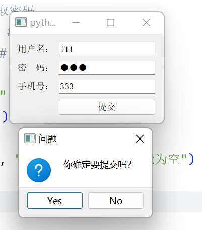

.assets/image-20250510094733493.png)

### 1.3 单、复选框

#### 1.3.1 单选框QRadioButton

.assets/image-20250510100412282.png)

#### 1.3.2 复选框QCheckBox

.assets/image-20250510101921000.png)

### 1.4 PyQt面向对象开发

.assets/image-20250510110413067.png)

.assets/image-20250510111827978.png)

- 添加模板代码

    - https://www.yuque.com/icheima/python/xgv93wgfqngez16y
    - https://snippet-generator.app/

    .assets/image-20240702105607878.png)

## 二、Qt Designer

- 在 Qt 程序开发过程中，除了通过手写代码实现软件开发功能，还可以通过 Qt 的界面设计师（Qt Designer）进行界面的绘制和布局。
- Qt 设计师（Qt Designer）提供了 Qt 基本的可绘制窗口部件，在设计器中可以通过鼠标直接拖拽这些窗口部件，能够高效、快速地实现图形界面的设计，界面直观形象，所见即所得。这样的优势在于在设计的同时能直观地看到界面上的部件，并且可以随时调整界面上的设计。
- VSCode添加外部工具教程：https://www.yuque.com/icheima/python/qt_designer#W6QF7

### 2.1 基本使用

.assets/image-20230822200534298.png)

.assets/image-20230822200653244.png)

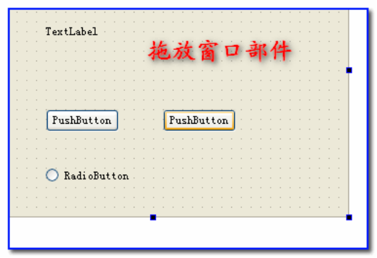

.assets/image-20230822201222671.png)

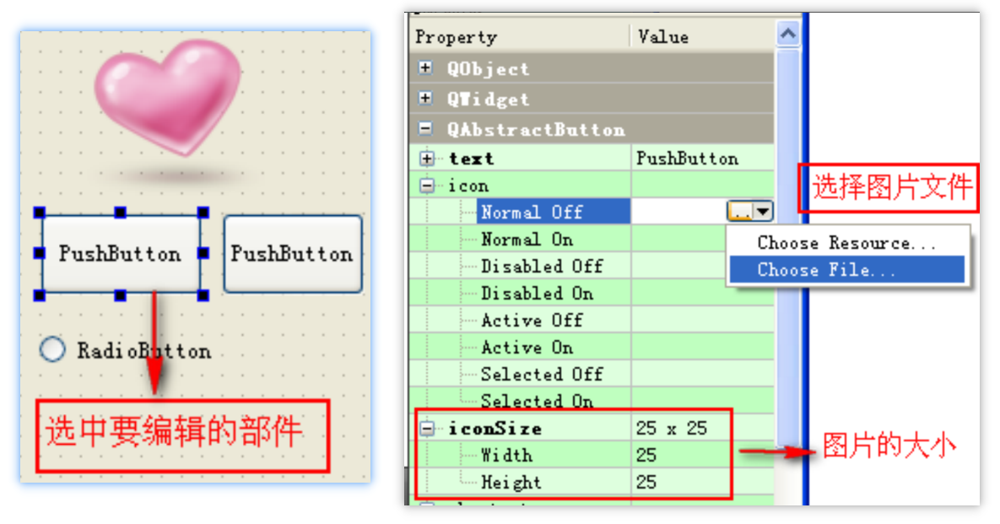

#### 2.1.1 设计界面

- 新建ui包

    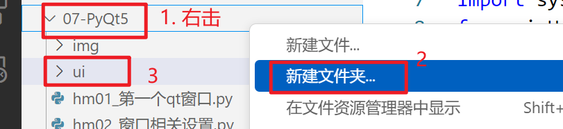

- 打开designer界面

    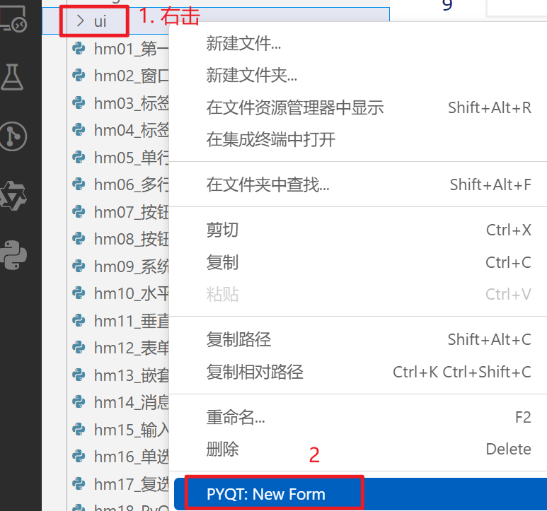

- 新建Widget窗口

    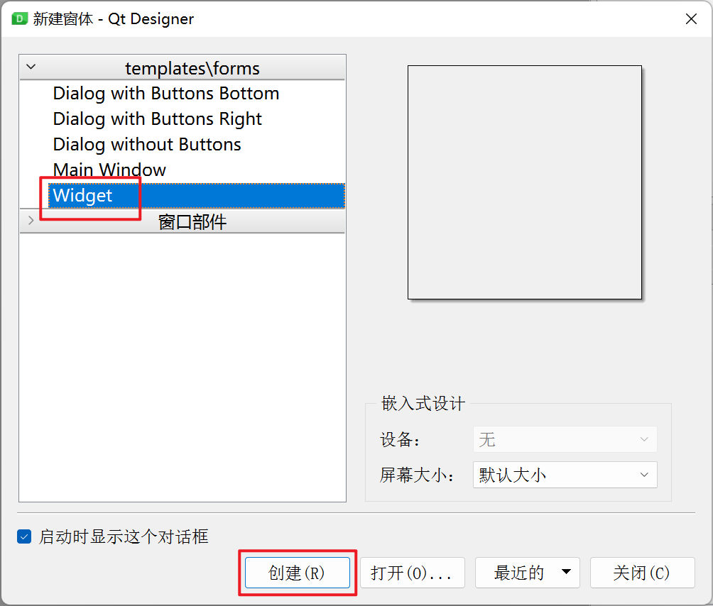

- 根据需要拖拽控件，然后保存

    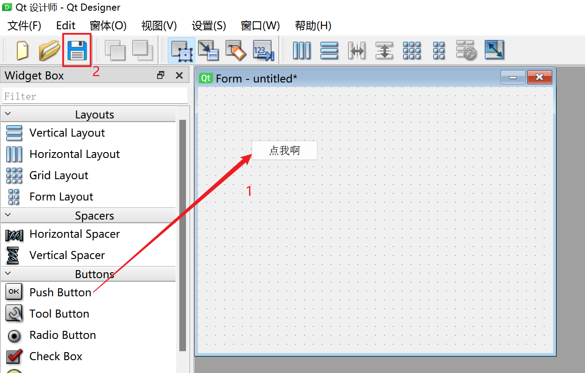

    

    .assets/image-20230822202628128.png)

- ui文件转换为python代码

    - **注意：每次修改了ui文件，记得保存，然后就得重新把ui文件转换为python代码**

    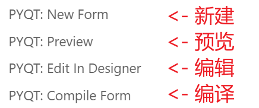

    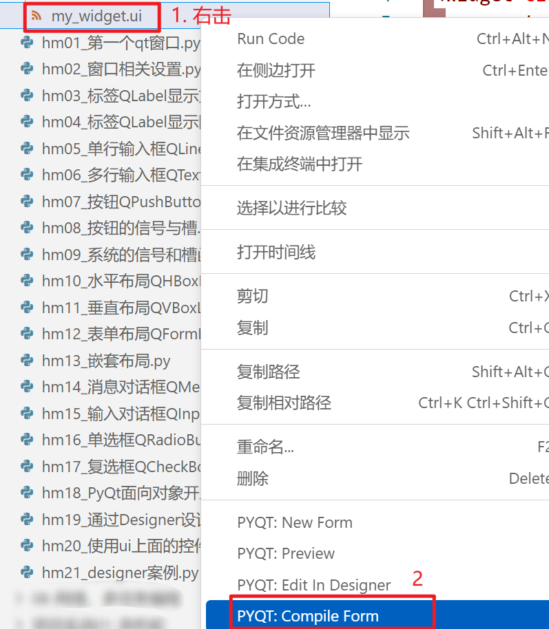

- 加载ui文件模板代码

    - 导包中模块  **from ui.ui模块文件名**    import     **Ui_对象名**

        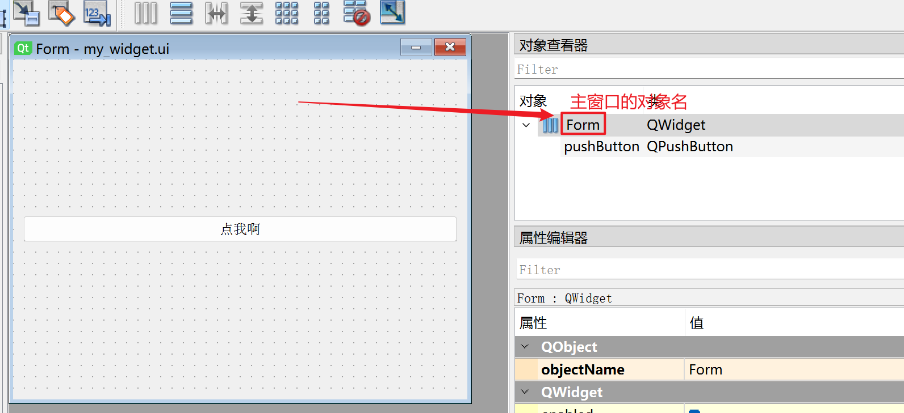

    - 实例化ui模块对象，调用setupUi()方法
    
        .assets/image-20231130100623068.png)

.assets/image-20250510115805627.png)


#### 2.1.2 如何使用ui上面的控件

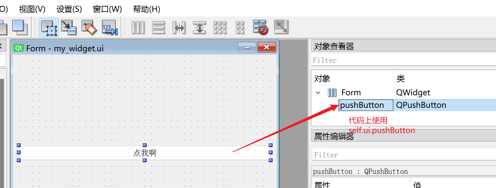

.assets/image-20250510143427230.png)

### 2.2 常见布局

#### 2.2.1 水平布局

.assets/水平03.png)

.assets/水平04.png)

.assets/水平05.png)

.assets/水平06.png)

.assets/水平07.png)

.assets/水平08.png)

.assets/水平09.png)

#### 2.2.2 垂直布局

.assets/垂直01.png)

.assets/垂直02.png)

#### 2.2.3 网格布局

.assets/网格01.png)

.assets/网格02.png)

.assets/网格03.png)


#### 2.2.4 借助弹簧布局

.assets/弹簧01.png)

.assets/弹簧02.png)

.assets/弹簧02.png)

.assets/弹簧03.png)

.assets/弹簧04.png)

#### 2.2.5 嵌套布局

.assets/嵌套01.png)

.assets/嵌套02.png)

.assets/嵌套03.png)

.assets/嵌套04.png)

.assets/嵌套05.png)

.assets/嵌套06.png)

.assets/嵌套07.png)

.assets/嵌套08.png)


## 三、事件处理

- 事件（event）是由系统或者 Qt 本身在不同的时刻发出的。当用户按下鼠标、敲下键盘，或者是窗口需要重新绘制的时候，都会发出一个相应的事件。

- **在所有控件的父类QWidget中，定义了很多事件处理的回调函数。**

    - **用户使用这些事件处理函数，在子类中重写这些事件函数，需保证函数名、参数的一致性。**

    .assets/image-20231130112810217.png)


### 3.1 鼠标事件QMouseEvent

```python
    from PyQt5.QtGui import *
    from PyQt5.QtCore import *
    
    def mouseMoveEvent(self, event: QMouseEvent): # 鼠标移动事件
    def mouseDoubleClickEvent(self, event: QMouseEvent): # 鼠标双击事件
    def mouseReleaseEvent(self, event: QMouseEvent): # 鼠标抬起事件
    def mousePressEvent(self, event: QMouseEvent): # 鼠标按下事件
```

.assets/image-20250510162203750.png)

.assets/image-20250510162533741.png)

### 3.2 绘图事件QPaintEvent

- 自动触发
    - 窗口有变化，自动调用
- 也可以，人为间接触发
    - update()

- **说明：绘图的操作，需要放在绘图事件中，否则，导致绘图失败**

```python
    from PyQt5.QtGui import *
    from PyQt5.QtCore import *
    
    def paintEvent(self, event: QPaintEvent): # 绘图事件
```

#### 3.4.1 绘图

.assets/image-20250510165803627.png)

.assets/image-20250510170359216.png)

#### 3.4.2 刷新绘图区域

.assets/image-20250510172553274.png)

## 四、自定义信号

**注意：自定义信号，类一定要继承于QObject，QWidget本身也是继承于QObject**

PyQt中自定义信号和槽的步骤如下：

1. 定义信号：在类中定义一个信号，使用PyQt的信号机制可以实现自定义信号。可以通过`pyqtSignal()`方法来创建一个信号对象。 

2. 连接信号和槽：使用`connect()`方法将信号和槽连接起来。 

3. 触发信号：在需要触发信号的地方，使用`emit()`方法来触发该信号。 

.assets/image-20231204233413794.png)


## 五、图片资源

- 加载图片资源后，把图片资源和代码编译在一起，运行时，不需再依赖图片路径了
  
- 示例演示：[资源非资源区别](./资源非资源区别)
  
- 打开资源管理器

    .assets/image-20250507145404041.png)

- 新建资源文件

    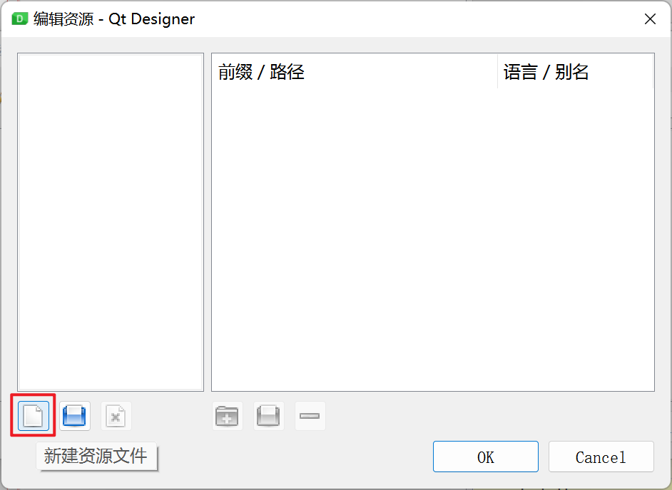

- 资源文件起名

    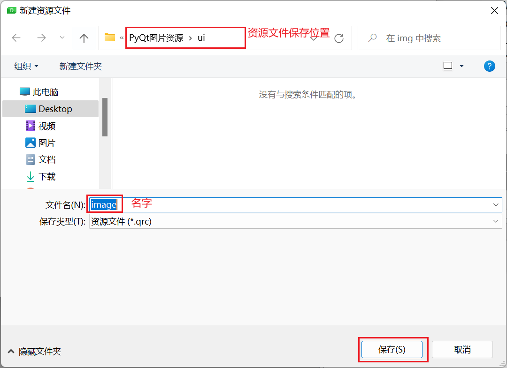

- 添加前缀

    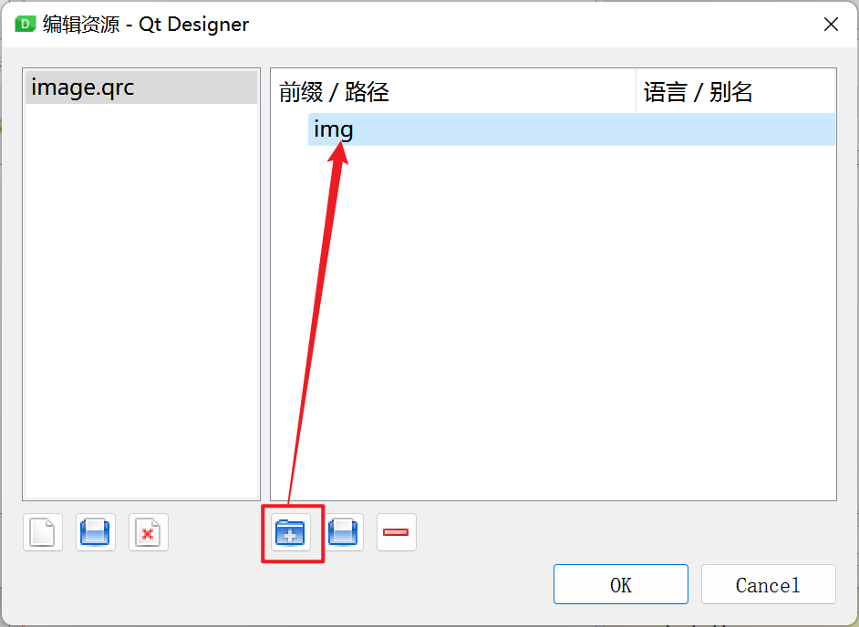

- 添加资源文件

    .assets/image-20250507151617232.png)

- 资源文件转换为python代码

    .assets/image-20250507152043016.png)

- ui中控件选择资源文件

    .assets/image-20250507152416944.png)

    .assets/image-20250507152509891.png)

- ui文件重新转换为python文件

    - **记得先保存ui文件，重新把ui文件转换为python代码**

    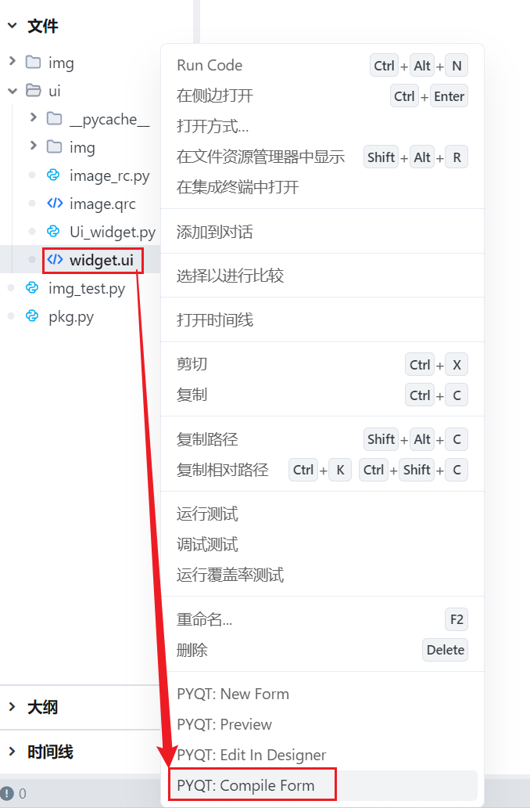

- 代码中资源路径如何写

    .assets/image-20250507152905568.png)

.assets/image-20250507153037173.png)